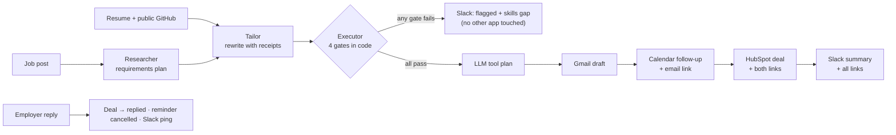

<div align="center">

# Honest Apply

**The job agent that won't lie for you.**

Three agents plan a job application, prove every line against the candidate's real resume,<br/>
then act across **Gmail, Google Calendar, HubSpot and Slack**, with each app handing off to the next.


**[Demo video](ADD_VIDEO_LINK_BEFORE_SUBMITTING)** · **[Try it in 60 seconds](#try-it-in-60-seconds)** · **[How the agent plans](#how-the-agent-plans)** · **[Reliability](#reliability-testing)**

Built for the Multi-App AI Agent Hackathon, September 13, 2026.

</div>

---

## For judges

| Checklist item | Where |
|---|---|
| 01 · Project overview | [The problem and what we built](#project-overview) |
| 02 · External apps used | [Four apps that hand off](#external-apps-used) (Gmail, Google Calendar, HubSpot, Slack) |
| 03 · Setup instructions | [Try it in 60 seconds](#try-it-in-60-seconds), then [go live](#connect-real-accounts) |
| 04 · Reliability testing | [How we know it works](#reliability-testing) and [docs/RELIABILITY.md](docs/RELIABILITY.md) |
| 05 · Demo video | [Watch the 2-minute demo](ADD_VIDEO_LINK_BEFORE_SUBMITTING) (script: [script.md](script.md)) |

## Contents

- [Project overview](#project-overview)
- [Try it in 60 seconds](#try-it-in-60-seconds)
- [How the agent plans](#how-the-agent-plans)
- [External apps used](#external-apps-used)
- [What makes it different](#what-makes-it-different)
- [Reliability testing](#reliability-testing)
- [Connect real accounts](#connect-real-accounts)
- [Project structure](#project-structure)
- [Limits and what's next](#limits-and-whats-next)

## Project overview

**The problem.** Students and early-career candidates applying at volume either spend an hour tailoring each
application or mass-apply with a generic resume. AI auto-apply tools make it worse: they stuff in skills the
candidate doesn't have, send emails nobody reviewed, and lose track of where you applied.

**What we built.** One multi-step agent, in three stages, that:

1. **Plans**: reads a job post and extracts what it really requires.
2. **Tailors with receipts**: rewrites the resume and cover note only from lines the candidate already has, citing
   the source line for every one. Skills can also come from the candidate's public GitHub repos, with the repo as the source.
3. **Checks, then acts**: verifies every receipt and three more hard gates *in code*, then uses LLM tool calling to
   decide which apps to act in: a Gmail draft, a Calendar follow-up, a HubSpot deal and a Slack summary, each passing
   its link to the next.

It keeps going after the application: a reply moves the CRM deal and cancels the reminder, and one click undoes
everything. It's built for individual job seekers and ready for the teams who place candidates (career centers,
staffing agencies), who already live in a CRM and Slack.

## Try it in 60 seconds

No accounts, no API keys:

```bash
git clone https://github.com/charansaiponnada/honest-apply.git
cd honest-apply
uv sync                      # or: pip install -r requirements.txt
uvicorn main:app             # from the repo root
```

| Open | What you'll see |
|---|---|
| **http://localhost:8000** | Landing page. Press **Watch it plan** in the agent console: a real run of the full agent, streamed live, with apps simulated. |
| **http://localhost:8000/demo** | The whole flow in 11 screens: connect apps, three agents, receipts, apps handing off, reply loop, fabrication gate, chaos test, undo, proof. **Simulated** by default; flip **Live apps** to use connected accounts. Arrow keys move between screens. |
| **http://localhost:8000/app** | The dashboard: run the agent on any job, job recommendations and batch apply, tracker with reply sync and undo, reliability suite, app connections. |

Simulated mode runs the real Researcher, Tailor and Executor. Only the four apps are simulated, enforced per run on the
server, so a simulated run never touches real accounts even when keys are configured.

## How the agent plans



| Stage | What happens | Output |
|---|---|---|
| **1 · Plan** (Researcher) | Extracts skills, seniority, must-haves and keywords. Concrete skills only. | `{"seniority": "Entry-level", "skills": ["Python", "FastAPI", ...]}` |
| **2 · Tailor** | Rewrites from existing lines, citing `source_line` for each. Optional GitHub evidence adds a labeled section naming the repos. | Tailored resume, cover note, receipts |
| **3 · Check** (Executor) | Four gates in code: keyword overlap ≥ 40%, receipts faithful, seniority fits, not a duplicate. Plus an advisory LLM fit review. | `faithful`, blocked claims, gap report |
| **4 · Act** (Executor) | Only after every gate passes, the LLM picks tools (`create_gmail_draft`, `schedule_followup`, `log_crm_deal`) over a multi-turn tool loop. It can do less, never skip a gate. Slack always runs. | App actions, each with an undo reference |
| **5 · Close the loop** | Reply tracker (Gmail → HubSpot stage → cancel reminder → Slack) and one-click undo across apps. | Updated deal, cancelled event, Slack messages |

If the LLM is unavailable (free-tier rate limit, a malformed response, no key), each agent falls back to a
rule-based mode and the run still completes, labeled as such.

## External apps used

| App | What the agent does there | How it connects |
|---|---|---|
| **Gmail** | Drafts the application with the tailored resume; sends only when every gate passes and the user allows it; reads replies | Per-user **Connect** via [Composio](https://composio.dev), or server OAuth |
| **Google Calendar** | Books a 7-day follow-up containing the email link; cancels it when a reply arrives | Composio, or server OAuth |
| **HubSpot CRM** | Creates a deal carrying both links; moves it to *replied*, or *closed-lost* on undo | Composio, or `HUBSPOT_TOKEN` |
| **Slack** | One message per outcome with every link, or why it stopped and the skills gap | Composio, or incoming webhook |

Supporting services: OpenRouter (LLM, including tool calling), public GitHub API (skill evidence) and public
job-board APIs (Arbeitnow, Remotive, RemoteOK) for live listings. LinkedIn, Indeed and Glassdoor are left out on
purpose: their terms prohibit scraping.

## What makes it different

| | |
|---|---|
| **Receipts** | Every tailored line must match a resume line, and every named tool, employer and number must exist in the original. Cover notes are checked too. One unbacked claim blocks every app. |
| **Gates in code, planning by the model** | The LLM plans and chooses tools; code decides whether anything may happen. |
| **Apps that hand off** | The email link goes into the reminder, both go onto the CRM deal, Slack gets all three. |
| **Reply loop and undo** | A reply updates the CRM, cancels the reminder and pings Slack. Undo deletes the draft and event, closes the deal and tells Slack. A sent email can't be recalled, and undo says so. |
| **Chaos panel** | Switch off Gmail, Calendar, HubSpot, Slack, the model (429) or the Google token, from the UI or the eval CLI. The real retry, classification and fallback code handles it. |
| **GitHub-verified skills** | Skills a job needs that the resume lacks but public repos show get added with the repo as the receipt. Plain words and short names in prose never count. |
| **Recommendations + batch apply** | Live listings ranked by skills the candidate can prove; up to 5 applied to in sequence, every gate per job. |
| **Sending is earned** | Gmail sends only with a connected account, the user's *Allow sending* switch, a recipient, overlap above `AUTO_SEND_THRESHOLD` and clean receipts. Otherwise it's a draft. |
| **Simulated mode** | Per-run, server-enforced mock apps, so the demo and the eval suite are reproducible and never post to real accounts. |

## Reliability testing

```bash
python -m eval.run_eval                          # 10 job descriptions, 4 checks each (always simulated apps)
python -m eval.run_eval --faults gmail,llm_429   # same suite with Gmail down and the LLM rate-limited
python -m eval.run_eval --pace 25                # live-LLM run paced for free-tier limits
```

The suite includes a strong fit, a poor fit, a non-engineering role, a staff role for a student resume, a one-line
posting, and one built to bait fabrication. Each job is scored on **extraction** (seniority and expected skills),
**faithfulness** (nothing unbacked reached an app), **decision** (flag vs. proceed matches `eval/expected.json`) and
**actions** (all succeed; under faults, every failure is reported with a reason and nothing crashes).

| Run | Passed | Extraction | Faithfulness | Decision | Actions |
|---|---|---|---|---|---|
| Normal (rule-based agents) | **9/10** | 9/10 | 10/10 | 10/10 | 10/10 |
| Gmail down + LLM 429 | **9/10** | 9/10 | 10/10 | 10/10 | 10/10 |

We also ran the pipeline end to end in real connected accounts (Gmail draft, Calendar event, HubSpot deal, Slack post,
then undo), and a partial live-LLM run of the suite. Live runs found ten real bugs that mock tests missed, from
double-escaped model output to cover-letter words read as claims, each fixed with a self-check. Every result,
failure mode and fix is in **[docs/RELIABILITY.md](docs/RELIABILITY.md)**, including what we couldn't measure.

Self-checks (each asserts real edge cases, including an injected fabricated bullet):

```bash
for m in executor llm tailor crm_action composio_client github_profile recommend resume_parse; do python -m agent.$m; done
python -m scripts.check_connections --ping       # preflight: LLM tool calling, Composio tools, Slack, job boards
```

The same eval runs are one click in the dashboard's **Reliability** page.

## Connect real accounts

### One-click Connect (recommended)

Set `COMPOSIO_API_KEY` in `.env` (a Composio **Platform** project key). In `/app` → **Apps & profile** (or `/demo`
screen 2), enter an email and click **Connect** for each app. Composio runs the OAuth flow and stores the tokens; the
agent acts on that user's accounts. Per app, per run: Composio connection → server keys → simulated.

### Or server keys

Copy `.env.example` to `.env`:

1. **LLM**: `OPENROUTER_API_KEY` from [openrouter.ai/keys](https://openrouter.ai/keys). Default model
   `nvidia/nemotron-3-super-120b-a12b:free`; override with `OPENROUTER_MODEL`.
2. **Gmail + Calendar**: Google Cloud project with both APIs, OAuth client (Desktop app) saved as `credentials.json`,
   consent screen in *Testing* with yourself as test user. Scopes: `gmail.compose`, `gmail.readonly`, `calendar.events`.
3. **HubSpot**: private app token with `crm.objects.companies`, `contacts`, `deals` read/write → `HUBSPOT_TOKEN`.
4. **Slack**: [incoming webhook](https://api.slack.com/messaging/webhooks) → `SLACK_WEBHOOK_URL`.

Then `python -m scripts.check_connections --ping`.

**Deploy:** one service, `uvicorn main:app --host 0.0.0.0 --port $PORT`, with the `.env` values as environment
variables. Hosts have no browser for Google OAuth, so paste the contents of `token.json` into `GOOGLE_TOKEN_JSON`.

### Frontend development

The landing page, dashboard and demo are one React + [shadcn/ui](https://ui.shadcn.com) app (Vite, Tailwind v4,
Base UI) in `frontend/`, with a lazy chunk per page. The design system (palette, type, motion and accessibility
rules) comes from UI/UX Pro Max: [`design-system/honest-apply/MASTER.md`](design-system/honest-apply/MASTER.md).
The production build is committed in `web/app-dist`, so running the server needs no Node.

```bash
cd frontend && npm install
npm run dev     # http://localhost:5173 (/, /app, /demo); proxies /api to uvicorn on :8000
npm run build   # typechecks, then writes ../web/app-dist
```

## Project structure

```
main.py                     FastAPI: pages, JSON API, live event streams (runs and batches)
agent/
  extract.py                Agent 1: Researcher
  tailor.py                 Agent 2: Tailor (receipts)
  executor.py               Agent 3: receipts check, fit review, tool planning
  pipeline.py               orchestration, gates, app chaining, simulated mode, run log
  gmail_action.py           Gmail draft / gated send / undo
  calendar_action.py        Calendar follow-up / undo
  crm_action.py             HubSpot company, contact, deal, stages
  slack_action.py           Slack messages
  reply_tracker.py          reply → CRM stage → cancel reminder → Slack
  undo.py                   reverse a run across apps
  composio_client.py        per-user Connect and tool execution
  github_profile.py         GitHub skill evidence
  recommend.py              job recommendations
  resume_parse.py           PDF / text upload
  guardrail.py              keyword overlap and thresholds
  llm.py                    OpenRouter JSON + multi-turn tool calling, fallbacks
  utils.py                  retries, error classification, chaos faults, simulated flag
frontend/src/
  landing/                  landing page with the live agent console
  demo/                     11-screen demo
  app/                      dashboard (sidebar, run, jobs, tracker, reliability, apps)
  components/ui/            shadcn/ui components
web/app-dist/               committed production build
eval/                       run_eval.py, expected.json, 10 sample job posts, sample resume
docs/                       PRD.md, RELIABILITY.md
design-system/              UI/UX Pro Max design system
scripts/check_connections.py
script.md                   2-minute demo video script
```

## Limits and what's next

- **Live-LLM numbers are partial.** The free model tier's daily cap ran out mid-evaluation; the table above is the
  rule-based path. A paced live re-run is the first thing to do with fresh quota.
- **Keyword overlap is a weak fit signal.** The seniority gate covers the worst case we found; an embedding or
  LLM-judged match alongside it is next.
- **Receipts can block good paraphrases** (it fails safe: flag, not send). Embedding similarity for line matching is next.
- **Duplicate detection reads the local run log**, not the CRM.
- **Per-user connections exist, per-user login doesn't yet.** Team workspaces for career centers and agencies are the
  roadmap after that.
